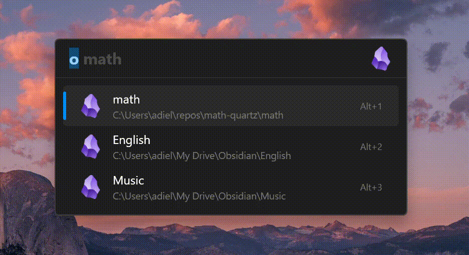

A [Flow Launcher](https://github.com/Flow-Launcher/Flow.Launcher) plugin to quickly search and open your [Obsidian](https://obsidian.md/) vaults.

> [!WARNING]
> This is very early version of the plugin, it may not work as expected. 

> [!NOTE] 
> If you are looking for a plugin to search and open Obsidian **notes**, check out [Obsidian Notes](https://github.com/Garulf/Obsidian-Notes/tree/main) plugin by Garulf. 
> If you are looking for a plugin to search Obsidian **plugins**, check out https://github.com/joethei/Flow-ObsidianPluginSearch plugin.

## Features

- Search for Obsidian vaults by name.
- Open vaults directly in Obsidian. (using the <kbd>Enter</kbd> key)
- Open vault folders in the file explorer. (using <kbd>Ctrl</kbd> + <kbd>Enter</kbd>, or using the context menu)

## Installation

currently, the plugin is not available in the Flow Launcher plugin store. you can install it manually by running the following command in Flow Launcher:

```
pm install https://github.com/adielBm/Flow.Launcher.Plugin.ObsidianVaults/releases/latest/download/Flow.Launcher.Plugin.ObsidianVaults.zip
```

## Screenshot


